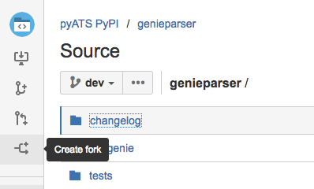

# Commit Guidelines

Depending on what you want to do with Genie, here are the steps to take:

#### GenieLibs

GenieLibs have four modules (conf, ops, sdk and robot).

* conf  - The features conf objects built as per the IETF/open-config standards
* ops   - The features ops objects built as per the IETF/open-config standards
* robot - Libraries related to the robot framework
* sdk   - Libraries and Datafiles deriving the tests (Triggers and Verifications)

To contribute to the any of the above four modules you need to do the following;

1 - Git clone the genielibs repo and uninstall the modules.

```bash
    git clone <this repo>
    pip uninstall genie.libs.conf genie.libs.ops genie.libs.sdk genie.libs.robot
```

2 - Activate the [develop mode] to start the commit process.

```bash
    cd genielibs/
    make develop
```

[develop mode]: http://setuptools.readthedocs.io/en/latest/setuptools.html#develop-deploy-the-project-source-in-development-mode

###### Conf/Ops

* Verify if an existing structure (feature structure, ex: BGP, OSPF,..) exists at
genielibs/src/conf and genielibs/src/ops. If not, create a new one following
[conf structure building guide](CONF.md) and [ops structure building guide](OPS.md) guides.

* You can always visit [conf documentation] and [ops documentation] for details
about conf/ops functionalities.

[conf documentation]: https://pubhub.devnetcloud.com/media/pyats-packages/docs/genie/Conf/index.html
[ops documentation]: https://pubhub.devnetcloud.com/media/pyats-packages/docs/genie/Ops/index.html

********All Conf/Ops must have unittest.********

###### To run the unittest;

```bash
    cd genielibs/src/conf/tests/
    runAll
    cd genielibs/src/ops/tests/
    runAll
```

###### Triggers and Verifications

* Verify if an existing trigger exists for this action (ex: ShutNoshut,
ConfigUnconfig,..) on the feature(ex: BGP, OSPF,..) at genielibs/src/sdk/triggers/. If not, create a new one
following [triggers] and [verifications] guides.

*********All developed triggers and verifications can be accesed at
$VIRTUAL_ENV/genie_yamls/(os)/trigger_datafile_(OS).yaml and
$VIRTUAL_ENV/genie_yamls/(os)/verification_datafile_(OS).yaml********

[triggers]: https://pubhub.devnetcloud.com/media/pyats-packages/docs/genie/harness/developer/triggers.html
[verifications]: https://pubhub.devnetcloud.com/media/pyats-packages/docs/genie/harness/developer/verifications.html

*********Before committing any trigger/verification/conf/ops object, you have to add it
to the module corresponding changelog so we can keep track of our development efforts. Changelog directory is
located at genielibs/pkgs/(pkg_name)/. It contains year/month.md files where we document our monthly
development.********

__Branches__: GenieLibs has three long lasting branches.

* Master: Only released code or about to be released
* Dev: Only stable, reviewed and and ready to ship code should be committed here. Before committing to this branch make sure you run all the unitest and they all pass. (Please submit a pull request BEFORE committing code here. If you do without, the commit will be removed)
* your_branch: All code development should be done in different branch. This is helpful for quickly changing work.


#### GenieParser

To contribute to GenieParser you need to do the following;

1 - Git clone the genieparser repo.

```bash
    git clone <this repo>
```

2 - Activate the __develop__ mode to start the commit process.

```bash
    cd genieparser/
    make develop
```

*********All parsers must have unittest.********

*********Before committing the new parsers, they must be added to the changelog.********

Here is the flow to be followed:

###### DevNet user

* Write some parsers
* Test on real devices
* Write some tests to make sure people modifying it in the future will not change your working parser.
* Raise a pull request

###### Cisco user

* Write some parsers
* Test on real devices
* Run the below script
* Diff the files to make sure only your new parser has been added
    * If not, need to figure out what is going on, do the necessary action
* Run Genie harness with a few triggers to remove the dynamic keys
* Update yaml files to remove dynamic keys.
* Pull request for GenieParser, with a link of the GenieLibs pull request in
the GenieParser one.
 
The script is run like this (this script generates verifications out of all the parsers under genieparser package):
cd $VIRTUAL_ENV/genie_yamls/tools/verification_generator
 
- python datafiles_maker.py -datafile parsers.yaml
 
Then you can use this differ.py to make the comparison easier. (As they are yaml, using differ.py removes order specific diffs)
 
- python differ.py -original ../../verification_datafile.yaml -new verification_datafile.yaml

##### Commit policy

* Every commit should contain a maximum of one feature or one bug fix (Do not
create a big commit). Go ahead and commit a lot of small working pieces. 

    For example: 1 commit = 1 parser

* Every commit must have a proper descriptive message


Example of Unittest already exists for each parser/conf/ops. The unittest must
test it can parse/generate the expected output. Unittest must cover empty output
and corner cases outputs. You can find example under genieparser/tests/(os)/(any file).py

###### To run the unittest;

```bash
    python test_(feature).py
```

##### Pull request

We welcome any contribution to Genie. Here's how

* Go to the github/bitbucket repository
* Click on 'create fork' on the top of the page (Make sure you are on dev branch).




* That will allow you to have a local repository.

* Do your changes and push them.

    * # Do the modifications on the file(s)
    * git add <file>                                          # Add files to git
    * git commit -m "some message explaining the change"      # Commit those files
    * git push origin branch_name                             # Push them

* Create a pull request.

* Our team will then be notified and we will review and approve it, then it
will automatically be merged to dev branch once approved.

##### Useful tools

* Coverage to make sure your unittest coverage is good.

        source <virtual env>
        pip install coverage
        cd tests directory
        coverage run -m unittest discover
        coverage html

* pep8 to make sure you respect pep8 rules.

        source <virtual env>
        pip install pep8
        deactivate
        pep8 <file>

* pylint to respect the style

        source <virtual env>
        pip install pylint
        deactivate
        pylint <file>

##### Unittest

All new code must have unittest and not break existing unittest.


##### Coding Style & Pylint

PEP8 is used as the reference for code style through out the project. However,
the following items needed to be highlighted:

* Strictly follow naming conventions in PEP8.
* Abide by the 80 characters limit per line. Few exceptions can be allowed.
* Leave 2 blank lines between classes, 2 lines between functions, and 1 line
between methods.
* Write the imports in the following order: Python native libraries, third parties, Genie libraries.