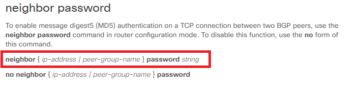
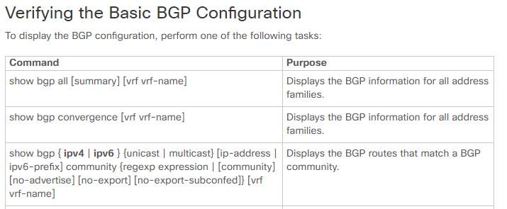

# Overview

Current development of Genie lib is focusing on feature Conf objects, however
there is no constraint or limitation in extending the Conf object to other
areas or to combination of features;  an example of such case is VXLAN.
VXLAN is not one feature, but is combination of multiple features such as BGP,
L2 features.

Genie team is actively developing Feature Conf libraries, these libraries are
open to any team to be used and be contributed to. Here is guide to new comers
to Genie creating on how to get started. First and most important step is to
build the Conf structure before developing the Conf object.


# How to create Common OS(XE/XR/NX) Conf Structure

1. Check Yang Models such as common models (IETF, OpenConfig) and native modes for XE/XR/NX.
If common model exists, use the common models as reference as it is applicable
to 3 platforms in most cases.

__Reference pointer__:

* [IETF Models]
* [OpenConfig Models]
* [Native Models]
* [Cisco Common Model]

[IETF Models]: https://github.com/YangModels/yang/tree/master/standard/ietf
[OpenConfig Models]: https://github.com/openconfig/public
[Native Models]: https://github.com/YangModels/yang/tree/master/vendor/cisco
[Cisco Common Model]: http://icd-nostg.cisco.com:9070/gitblit/tree/?r=xos/ddmi.git&h=master

Generate a yang model tree by using the "pyang" command (__pyang__ can be installed by 'pip install pyang' )

Use the Pyang tree structure as a reference when creating the Feature Conf
Structure. In the Yang Model, the 'rw'(read-write)  is equivalent to the 'Conf' 

```
    > pyang -f tree openconfig-routing-policy.yang
    openconfig-routing-policy.yang:12: error: module "openconfig-interfaces" not found in search path
    module: openconfig-routing-policy
        +--rw routing-policy
           +--rw defined-sets
           |  +--rw prefix-sets
           |  |  +--rw prefix-set* [prefix-set-name]
           |  |     +--rw prefix-set-name    -> ../config/prefix-set-name
           |  |     +--rw config
           |  |     |  +--rw prefix-set-name?   string
           |  |     +--ro state
           |  |     |  +--ro prefix-set-name?   string
           |  |     +--rw prefixes
    (snip)

```

__Tips__: check the tree  for related Yang files (ex:  openconfig-routing-policy.yang, openconfig-policy-types.yang)

2. Based on the generated Yang Tree (shown above) the Conf Structure can be
designed. The structure should be designed to be  applicable to all 3 OS
(XE/XR/NX) as much as possible otherwise it will have limited use. Check the
configuration style on each platform as its hierarchy needs to be considered
for configuration mode such as router configuration mode(config-router),
interface configuration mode(config-if).


Attribute Column:  List all the configuration attributes at most left column then create the Platform Columns for each supported OS (XE, XR and NX) . 


***Beware of following key points for each column:***

* Attribute column: it contains the attribute name, value type (Str, Int, Enum,
Boolean, List and range if applicable)

```
    instance_name <<< attribute name
    -Str <<< value type
```

    The attribute name should be based on Yang Model name; For the attribute 
    type check Yang Model  to decide on the value type , make sure it's
    applicable to all platforms.

    Possible value types:
      - Str : String such as access-list name, process name
      - Int : Integer. just number
      - Boolean : True or False. If the attribute can be turned on or off.
      - List : List of values, ['192.168.1.1', '192.168.2.1']
      - Enum : Enum('A', 'B', 'C'), should be one of hem, 'A' or 'B' or 'C'

    If attributes can not be found in  Yang model,  they can be added to the structure following the same naming convention as Yang model.

    If a command requires more than one attributes, list all  attributes in the same row  as shown below.

    ps_ebgp_multihop
    -Boolean
    ps_ebgp_multihop_max_hop
    -Int <1-255>

    If there are differenced in platform for value types for an attribute, several value types can be set. Below is an example  for an attribute "tag",  the type can be set as Int or Str.

    set_tag
    -Int|Str


* Platform column: contains the configuration command, the show command and the 
exact line to verify the configuration. If the platform does not support the
configuration, note should be added "Not supported".   

```
    router bgp <bgp_id>  -> configuration command with attribute name

    #show bgp all summary | i local AS number <<< show command for verification
    BGP router identifier 2.2.2.2, local AS number 100 <<< exact line from show command where you can verify the configuration by this attribute (if possible)
```

    Check the platform command references document on Cisco.com to verify if
    the equivalent configuration attribute is supported , and the correct
    syntax of the configuration. 

Command Rerences:
* [XE]
* [XR]
* [NX]

[XE]: http://www.cisco.com/c/en/us/support/ios-nx-os-software/ios-xe-3s/products-command-reference-list.html
[XR]: http://www.cisco.com/c/en/us/support/ios-nx-os-software/ios-xr-software/products-command-reference-list.html
[NX]: http://www.cisco.com/c/en/us/support/switches/nexus-9000-series-switches/products-command-reference-list.html
    
    ***NOTE: You should check appropriate documents based on your platform and version.***

    For example to verify the syntax for  "neighbor password" refer to [verify].

[verify]: http://www.cisco.com/c/en/us/td/docs/ios-xml/ios/iproute_bgp/command/irg-cr-book/bgp-m1.html#wp7418204620



3. Provide list of all the show commands that can be used to extract the
attribute values. These commands will be used for both Conf and Ops structure
(Guideline Ops structure). 

  

  You can find related show commands from above command reference (In step3) or
  below configuration guides.

  Configuration Guides:

  * [XE]
  * [XR]
  * [NX]

[XE]: http://www.cisco.com/c/en/us/support/ios-nx-os-software/ios-xe-3s/products-installation-and-configuration-guides-list.html
[XR]: http://www.cisco.com/c/en/us/support/ios-nx-os-software/ios-xr-software/products-installation-and-configuration-guides-list.html
[NX]: http://www.cisco.com/c/en/us/support/ios-nx-os-software/nx-os-software/products-installation-and-configuration-guides-list.html

  [example].

[example]: http://www.cisco.com/c/en/us/td/docs/switches/datacenter/nexus9000/sw/6-x/unicast/configuration/guide/l3_cli_nxos/l3_bgp.html
  
 

4. You may raise a pull request for Genie team to review your structure before it is 
merged to Genie library.
