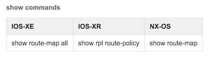
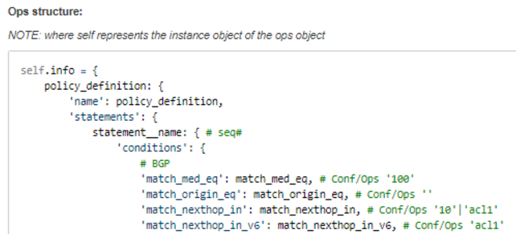

# Overview

Current development of Genie lib is focusing on feature Ops objects, however
there is no constraint or limitation in extending the Ops object to other areas
or to combination of features;  an example of such case is VXLAN. VXLAN is not
one feature, but is combination of multiple features such as BGP, L2 features.

Genie team is actively developing Feature Ops libraries, these libraries are
open to any team to be used and be contributed to. Here is guide  to new comers
to Genie creating on how to get started. First and most important step is to
build the Ops structure before developing the Ops object.

# How to create Common OS (XE/XR/NX) Ops structure

### Steps:

1. Follow the step 1 and step2  of Common OS Guideline Conf Structure.

2. Create Ops structure based on Yang Model Tree. If attributes can not be
found in  Yang model,  they can be added to the structure following the same
naming convention as Yang model.

3. List of all the show commands that can be used to extract the attribute
values. These commands will be used for both Conf and Ops structure

4. Ops structure should be python dictionary style.

***Here are some key points when creating above Ops structure.***

* All attributes in Conf structure should be in Ops structure.
* '#" is comment. Each attribute should have the information like 'Conf/Ops'
which indicates the attribute can be applicable for both Conf and Ops.
* self.info is mandatory Ops object. You can create some objects if applicable.
In case of BGP, we have 'self.info', 'self.routes_per_peer' and 'self.table'
to separate Ops information.
* Any hierarchy key can be added to increase readability and grouping the attributes.

5. You may raise a pull request for Genie team to review your structure before it is 
merged to Genie library.

